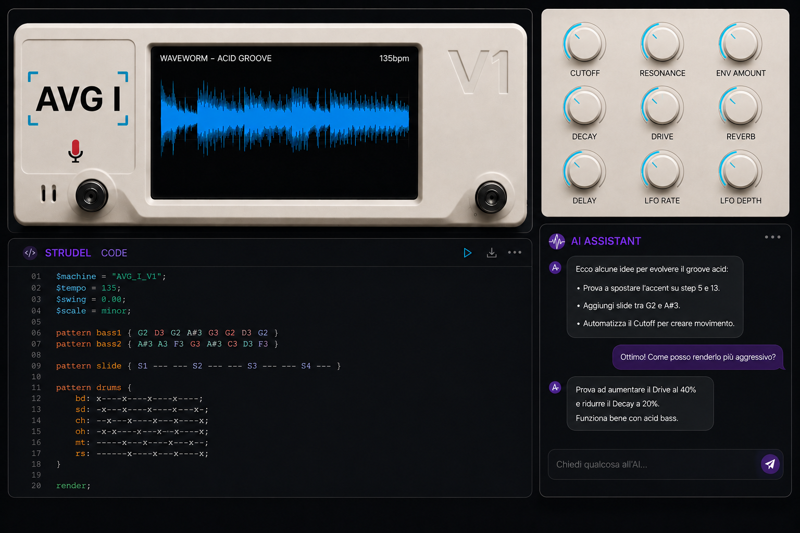

# AVG I — Live Synthesis Engine

> Compose music in plain language. A multi-agent AI system translates your words into live [Strudel](https://strudel.cc) code, plays it in the browser, and hands you real-time controls — all without touching a DAW.



---

## What it does

You type a musical intent in natural language. A pipeline of specialized AI agents interprets it, generates [Strudel](https://strudel.cc) pattern code, creates knob controls, and streams audio through a full FX chain — all in real time.

```
You type:  "add a deep bass with a house rhythm"
    ↓
Supervisor      → classifies intent
    ↓
Music Expert    → translates to musical specifications
    ↓
Strudel Coder   → generates Strudel pattern code
    ↓
Knobs Agent     → creates real-time parameter controls
    ↓
Response Agent  → streams back a human reply
    ↓
Browser Player  → plays audio via Web Audio API + FX chain
```

---

## Features

### AI Chat & Composition
- **Natural language composition** — describe any musical idea, the system generates and plays it
- **Real-time streaming** — AI response streams character-by-character with animated cursor
- **Auto error recovery** — when Strudel throws a runtime error, the agent detects and fixes it automatically
- **Creative mode** — the system autonomously proposes variations when no explicit instruction is given
- **Full conversation context** — agents share a rolling history of the musical session

### Code Editor
- **Monaco Editor** with full Strudel syntax highlighting (keywords, methods, sample names, numbers)
- **Autocomplete** for all Strudel functions (`sound`, `note`, `stack`, `fast`, `slow`, …) and sample names
- **Hover documentation** on every function
- **`Ctrl+Enter`** — evaluates code immediately, bypassing debounce
- **Manual editing** — edit code directly; the backend uses your edits as context on the next generation
- **AI code animation** — generated code appears with a typewriter effect

### Audio Player & FX Chain
- **Strudel REPL** embedded — native Web Audio API, no external dependencies
- **▶ PLAY / ■ STOP** transport controls
- **3-second debounce** — code is re-evaluated 3 s after the last keystroke
- **● LIVE / ⟳ LOAD** status indicators

**Signal chain:**

```
Strudel REPL → Compressor → EQ (3-band) → Drive → Reverb → Delay → Master Volume → Output
```

| FX | Details |
|----|---------|
| Compressor | Threshold −12 dB, ratio 4:1 |
| EQ Low | Low shelf at 200 Hz |
| EQ Mid | Peaking at 1 kHz |
| EQ High | High shelf at 6 kHz |
| Drive | Soft-clip waveshaper |
| Reverb | Convolution with synthetic IR |
| Delay | 0.35 s feedback delay, independent wet |
| Master Volume | Final gain before output |

### Waveform Visualizer
- Real-time 60 fps FFT canvas (2048-point analyser)
- Chromatic gradient (teal → blue → violet → pink) mapped to frequency
- Expands to 60 vh in Performance Mode

### BPM & EQ Panel
- **BPM knob** — drag to change tempo (40–240 BPM), updates `setcpm()` in the live code
- **TAP** — tap 3+ times to set BPM from groove (rolling average, resets after 2 s)
- **Beat Indicator** — teal dot pulses in sync with the current BPM
- **EQ faders** — vertical drag controls for LOW / MID / HIGH
- **FX faders** — RVB / DLY / DLT / DRV / VOL

### Preset System
- **16 preset slots** in a collapsible drawer
- **Save / Load** — left-click to load; **SAVE** button writes current code + BPM
- **Inline rename** — double-click any slot to rename it
- **Color picker** — 8 accent colors to visually distinguish presets
- **BPM badge** — each tile shows the saved BPM
- **localStorage persistence** — presets survive page refresh
- **Active slot indicator** — highlighted tile + label in the header

### Scene Queue (queue-on-cycle)
- **⏭ Queue** — schedule a preset to switch at the next musical cycle (4 beats)
- **BPM-aware sync** — transition happens exactly at the next cycle boundary
- **Visual feedback** — queued tile blinks orange; header shows "⏭ next: [name]"
- `queued_slot` is sent to the backend in every message to keep AI context in sync

### Performance Mode
- **`F` key** — toggle Performance Mode from anywhere outside an input field
- **`Esc`** — exit Performance Mode
- Hides chat, header, and hints; expands the waveform and instrument controls full-screen
- Preset drawer becomes full-width for quick scene switching on stage

### MIDI Output
- **MIDI Clock at 24 PPQN** — sync hardware synths and DAW to the current BPM
- **MIDI Start / Stop** — sends proper transport control messages
- **`GET /midi/ports`** — lists available MIDI output ports on the system
- **`midi_config` WebSocket message** — enables/disables output and selects the port at runtime
- **Live BPM sync** — when the AI updates BPM, the MIDI clock adjusts immediately
- **Dedicated thread** — clock runs in background without blocking the server

### Recording
- **● REC** — captures audio output as `.webm`
- File downloads automatically when recording stops

### AI Knob Panel
- Sliders generated dynamically by the AI for each active Strudel parameter
- Live updates: changing a knob rewrites the code without re-invoking the AI
- Scrollable horizontal strip in the transport bar

---

## Architecture

```
┌─────────────────────────────────────────────────┐
│                    Frontend (React + Vite)       │
│  Chat │ Monaco Editor │ Strudel Player │ Knobs   │
│  Waveform │ BPM+EQ │ Presets │ Scene Queue       │
└──────────────────┬──────────────────────────────┘
                   │  WebSocket  (ws://localhost:8000/ws)
┌──────────────────▼──────────────────────────────┐
│                 Backend (FastAPI + LangGraph)    │
│                                                 │
│  Supervisor ──► Music Expert ──► Strudel Coder  │
│       │                                │        │
│       └──► Creative Agent              │        │
│       └──► Error Recovery Agent        │        │
│                              Knobs Agent        │
│                              Response Agent     │
│                                                 │
│  MIDI Service  (python-rtmidi, 24 PPQN clock)   │
│  LiteLLM       (Ollama / OpenAI / Anthropic)    │
└─────────────────────────────────────────────────┘
```

**Backend stack:** Python 3.11, FastAPI, LangGraph, LiteLLM, python-rtmidi  
**Frontend stack:** React 18, TypeScript, Vite, Monaco Editor, Strudel REPL

---

## Requirements

| Dependency | Version |
|------------|---------|
| Python | 3.11+ |
| Node.js | 18+ |
| Ollama *(local LLM only)* | latest |

---

## Installation

### 1. Clone

```bash
git clone https://github.com/your-username/avg-i.git
cd avg-i
```

### 2. Backend

```bash
cd backend
python -m venv .venv
source .venv/bin/activate        # macOS / Linux
# .venv\Scripts\activate         # Windows

pip install -r requirements.txt
```

### 3. Frontend

```bash
cd frontend
npm install
```

### 4. LLM setup

**Option A — Local (Ollama, no API key required):**

```bash
# Install from https://ollama.com
ollama pull gemma3:4b        # default model (~2 GB)
# or:
ollama pull qwen2.5:7b       # higher quality (~4.5 GB)
```

**Option B — Cloud (OpenAI / Anthropic):**

```bash
cp .env.example .env
# edit .env and set your API key
```

---

## Configuration

### LLM model — `backend/config.yaml`

```yaml
llm:
  model: "ollama/gemma3:4b"           # local (default)
  # model: "ollama/qwen2.5:7b"
  # model: "openai/gpt-4o-mini"
  # model: "anthropic/claude-haiku-4-5-20251001"
  temperature: 0.3
  max_tokens: 10000
```

### Cloud API keys — `.env`

```dotenv
# OpenAI
LLM_MODEL=openai/gpt-4o-mini
OPENAI_API_KEY=sk-...

# Anthropic
LLM_MODEL=anthropic/claude-haiku-4-5-20251001
ANTHROPIC_API_KEY=sk-ant-...
```

Copy `.env.example` to `.env` and fill in your key. The `start.sh` script automatically skips launching Ollama when a cloud provider is configured.

---

## Quick Start

```bash
./start.sh
```

Opens backend, frontend, and (optionally) Ollama in separate Terminal windows, then launches the browser.

**Or manually in three terminals:**

```bash
# Terminal 1 — local LLM (skip if using cloud)
ollama serve

# Terminal 2 — backend
cd backend && source .venv/bin/activate
uvicorn backend.main:app --port 8000

# Terminal 3 — frontend
cd frontend && npm run dev
```

Open **http://localhost:5173** and start composing.

---

## Usage

### Basic composition

1. Type a musical idea in the chat input and press **Enter** or click **Send**
2. The AI generates Strudel code and plays it automatically
3. Adjust BPM with the knob or **TAP** button
4. Tweak FX levels with the vertical faders

### Presets

1. Click any preset slot to load it
2. After editing, click **SAVE** to overwrite the active slot
3. Double-click a slot to rename it
4. Use the **⏭ Queue** button to schedule a scene change at the next cycle

### Manual code editing

- Edit code directly in the Monaco Editor
- Press **`Ctrl+Enter`** to evaluate immediately
- The next AI generation will use your manual edits as context

### Performance mode

Press **`F`** to enter a distraction-free view with only the waveform and instrument controls. Press **`Esc`** to return.

---

## Keyboard Shortcuts

| Key | Action |
|-----|--------|
| `F` | Toggle Performance Mode (outside input fields) |
| `Esc` | Exit Performance Mode |
| `Ctrl+Enter` | Evaluate code immediately |

---

## WebSocket API

**Frontend → Backend:**

```jsonc
// Natural language message
{ "type": "user_message", "message": "...", "current_code": "...", "manually_edited": false, "queued_slot": null }

// Knob change (direct parameter update, no AI call)
{ "type": "knob_change", "knob_name": "gain", "value": 0.8 }

// Runtime error (triggers auto-recovery agent)
{ "type": "runtime_error", "message": "SyntaxError: ..." }

// MIDI configuration
{ "type": "midi_config", "enabled": true, "port_index": 0 }
```

**Backend → Frontend:**

```jsonc
{ "type": "connected" }
{ "type": "stream_chunk", "text": "Adding a bass line..." }
{ "type": "update", "code": "...", "knobs": [...], "message": "...", "creative_mode": false, "code_error": "" }
{ "type": "midi_status", "connected": true, "port": 0 }
```

**REST:**

```
GET /health       → { "status": "ok" }
GET /midi/ports   → { "ports": ["IAC Bus 1", ...] }
```

---

## Testing

```bash
# Backend (pytest)
cd backend && source .venv/bin/activate
pytest ../tests/ -v

# Frontend (Vitest)
cd frontend && npm test

# Coverage
cd frontend && npm run coverage
```

---

## Project Structure

```
avg-i/
├── backend/
│   ├── agents/
│   │   ├── supervisor.py          # classifies user intent
│   │   ├── music_expert.py        # natural language → musical specs
│   │   ├── strudel_coder.py       # specs → Strudel pattern code
│   │   ├── knobs_agent.py         # generates real-time controls
│   │   ├── creative_agent.py      # autonomous variation proposals
│   │   ├── error_recovery_agent.py# fixes Strudel runtime errors
│   │   └── response_agent.py      # streaming human-readable reply
│   ├── prompts/                   # YAML prompt templates per agent
│   ├── midi_service.py            # MIDI clock (24 PPQN), start/stop
│   ├── config.yaml                # LLM model + parameters
│   ├── graph.py                   # LangGraph StateGraph definition
│   ├── main.py                    # FastAPI app + WebSocket + REST
│   ├── state.py                   # shared MusicState TypedDict
│   └── requirements.txt
├── frontend/src/
│   ├── components/
│   │   ├── Chat.tsx               # streaming chat with markdown rendering
│   │   ├── StrudelPlayer.tsx      # Strudel REPL + full FX chain
│   │   ├── CodeEditor.tsx         # Monaco editor with Strudel language
│   │   ├── BpmEqPanel.tsx         # BPM knob + EQ/FX faders + TAP
│   │   ├── BeatIndicator.tsx      # beat-synced pulsing dot
│   │   ├── KnobPanel.tsx          # dynamic AI-generated sliders
│   │   ├── PresetDrawer.tsx       # 16-slot preset manager + queue
│   │   ├── Waveform.tsx           # animated FFT canvas
│   │   └── Recorder.tsx           # .webm audio recorder
│   ├── hooks/
│   │   ├── useWebSocket.ts        # WebSocket with streaming accumulation
│   │   ├── usePresets.ts          # preset CRUD + localStorage
│   │   ├── useSceneQueue.ts       # queue-on-cycle BPM-aware scheduling
│   │   └── useTapTempo.ts         # rolling average tap tempo
│   ├── lib/
│   │   ├── strudelLanguage.ts     # Monaco language definition + dark theme
│   │   ├── audioFx.ts             # waveshaper curve, reverb IR synthesis
│   │   └── strudel-bundle.ts      # bundled Strudel REPL
│   └── App.tsx
├── tests/                         # pytest backend test suite
├── .env.example                   # environment variable template
├── start.sh                       # one-command startup (macOS)
└── README.md
```

---

## License

MIT
